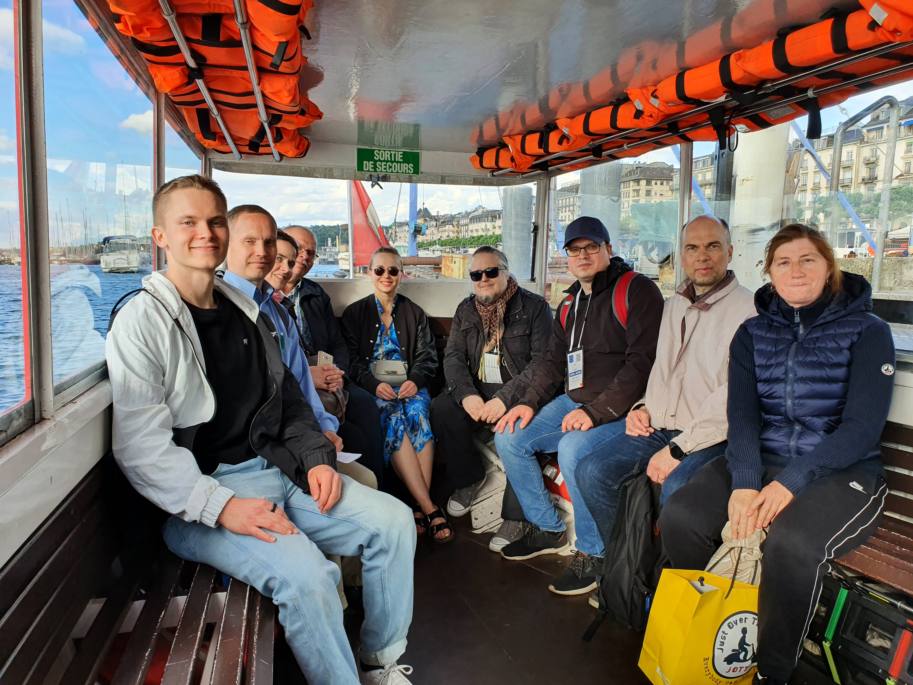

# Kesäharjoittelijana avoimen datan parissa CERN:ssä 2022

Olen Santeri ja opiskelen matematiikkaa ja systeemitieteitä Aalto-yliopistossa. Työskentelin kesän 2022 CERN:ssä Fysiikan tutkimuslaitoksen (HIP) Summer Trainee -ohjelmassa. CERN, Euroopan hiukkasfysiikan tutkimuskeskus, on yksi maailman suurimmista tieteellisistä projekteista. Sen parissa työskentelee tuhansia tieteilijöitä ja insinöörejä tarkoituksenaan tutkia aineen rakenneosasia, eli sitä, mistä universumi oikein on tehty. Projektini aiheena oli avoin data opetuksessa, ja tehtäväni oli luoda ja kääntää opetusmateriaaleja, joissa hyödynnetään avointa dataa. Lisäksi pidin työpajoja opettajille sekä muille kesätyöntekijöille. 

Kesä CERN:ssä oli todella avartava kokemus. En ollut koskaan ollut kauaa pois Suomesta, ja nyt vuorossa oli kolmen kuukauden pituinen reissu ulkomailla. Etäisyys kotipuoleen auttoi minua löytämään uusia puolia itsestäni ja heittäytyä uusiin asioihin eri tavalla kuin Suomessa. Lisäksi se antoi tilaisuuden tutustua CERN:läisiin ja muihin ihmisiin. Kun saavuin CERN:iin, pääsin heti näkemään sen hienouksia yhdessä suomalaisten opettajien kanssa. CERN järjestää opettajakoulutuksia eri maan opettajille, ja sattui sopivasti, että ensimmäinen koulutus rajoitusten höllentämisen jälkeen järjestettiin suomalaisille, ja se järjestettiin aloitusviikollani. Niinpä pääsin ensimmäisellä viikolla opettajien matkaan kuulemaan CERN:in tutkimuksesta ja kiertämään sen eri rakennuksissa oppimassa sen erilaisista kokeista. Se oli hieno orientaatioviikko siihen, mitä kesä toisi tullessaan.

Opettajien kanssa Genevessä

Kesätyössä suurin osa ajastani meni opetusmateriaalien kirjoittamiseen, parantelemiseen ja kääntämiseen. Opetusmateriaalit ovat [Jupyter Notebook](https://opendata-education.github.io/fi/jupyter/jupyter) -alustalla, joka mahdollistaa tekstin,  koodin ja kuvien lisäämisen sulavasti samaan dokumenttiin. Keskityin erityisesti hiukkasfysiikka-aiheisiin materiaaleihin ja käytin CERN:n CMS-detektorin julkaisemaa avointa dataa. Tein myös intromateriaaleja data-analyysiin, jolloin datan ei tarvinnut olla mistään tietystä aihepiiristä. Hiukkasfysiikan lisäksi avointa dataa voi toki käyttää muissakin aineissa, kuten biologiassa ja maantieteessä, mutta en kesän aikana ehtinyt paneutua kovin syvällisesti mihinkään tiettyyn aineeseen.

Kesätyöni oli joustavaa. Sain tehdä töitä liukuvin työajoin sekä päättää paljon siitä, mihin työssäni keskityn. Tämä itsenäisyys yllätti minut, sillä en ollut aiemmin ollut oman alan töissä, ja ajattelin, että minua ohjattaisiin kädestä pitäen monessa asiassa. Pidin kuitenkin siitä, että sain itse vaikuttaa niin paljon kesätyöni sisältöön. CERN:ssä välitetään siitä, että kesätyöntekijät saavat kokemuksestaan hyödyllisiä taitoja omalle urallensa, ja uusien asioiden oppimista pidetään suuressa arvossa. Erityisen palkitsevaa ja haastavaa oli työpajojen suunnittelu ja pitäminen. Pidin kesän aikana kolme työpajaa: kaksi kansainvälisille opettajille osana opettajakoulutusohjelmaa, sekä yhden muille kesäopiskelijoille. Työpajojen suunnittelussa minulla oli paljon vastuuta. Vaikka kaikki niistä eivät menneetkään juuri niin kuin olisin halunnut, mitään vakavaa epäonnistumista ei tapahtunut, ja opin prosessissa paljon. Lisäksi oli motivoivaa kuulla, kuinka osa osallistujista innoistui avoimen datan käytöstä opetuksessa. Lisää työpajojen sisällöstä voi lukea [tästä blogitekstistä](https://opendata-education.github.io/Blogi/tekstit/opettajatyopaja_CERN.html).

Oman projektin parissa työskentelyn lisäksi aikaa kului heinäkuussa kesäopiskelijoita varten luotujen luentojen parissa. Luennoilla opetettiin hiukkasfysiikan peruskonsepteja, hiukkasfysiikan tutkimuksessa käytettävän laitteiston periaatteita sekä muita aiheeseen liittyviä asioita. Vaikka monet luennoista olivat melko vaikeita minulle, ne antoivat hyvän yleiskatsauksen siihen, mistä CERN:ssä on kyse. Lisäksi meille järjestettiin vierailuja erilaisiin kokeisiin CERN:ssä. 

CERN:ssä oli kesällä yli 300 kesäopiskelijaa, ja ehdin tutustua vain murto-osaan heistä. Suuri opiskelijamäärä tarkoittaa sitä, että on paljon mahdollisuuksia tutustua toisiin järjestämällä esimerkiksi yhteisiä tapahtumia ja yhteisiä reissuja. Sainkin CERN:stä hyviä ystäviä yhteisten kokemusten kautta, niin Suomesta kuin muualtakin. Yksi CERN:n hienoimmista asioista onkin sen kansainvälisyys. Saman pöydän äärestä voi löytää ihmisiä niin Chilestä, Jordaniasta kuin Bulgariastakin. Uusiin kulttuureihin tutustuminen on aina kiinnostavaa, ja niin on myös omasta kulttuurista kertominen. Yksi kesän kohokohdista oli se, kun me suomalaiset kesäopiskelijat järjestimme Mölkky-turnauksen muille kesäopiskelijoille, ja paikalle saapui yli 60 osallistujaa. Mölkky oli muutenkin kesän ykköspeli, ja sitä tuli pelattua paikassa kuin paikassa.

Osallistujat ympäri maailman kisasivat Mölkyn mestaruudesta CERN:ssä.

CERN sijaitsee Genevessä, Sveitsin ja Ranskan rajalla. Ylitin maiden rajan joka päivä pyöräillessäni kimppakämpästä Ranskan puolelta Sveitsiin. Tämä kuvastaakin sitä, kuinka helppoa Genevestä on lähteä muualle päin Eurooppaa: kaikki tuntuu olevan lähellä verrattuna Suomen eristäytyneisyyteen. Olin ostanut keväällä Interrail-lipun, jonka avulla pystyin matkustamaan junalla ilmaiseksi tai pientä maksua vastaan koko kesän. Kävin esimerkiksi Interlakenin lähistöllä ihailemassa Sveitsin upeita vuoria sekä Annecyssa Ranskassa riippuliitämässä ja katsomassa Euroopan suurinta pyroteknistä esitystä. Kävin myös äitini ja veljeni kanssa kiertämässä Italiaa, Monacoa ja Ranskaa. Kaikki tämä matkustelu tuntui erityisen hyvältä siksi, etten koronapandemian vuoksi ollut juurikaan päässyt matkustelemaan pitkään aikaan. Toisaalta Genevessä kesäkaupunkina ei ollut mitään valittamista. Genevenjärven vesi on todella kirkasta, ja uin siinä useat kerrat lievittääkseni Euroopan helleaallosta aiheutuvaa tukaluuden tunnetta. Lisäksi kävin monissa Geneven ilmaisissa konserteissa nauttimassa livemusiikista, jota oli ehtinyt tulla ikävä korona-aikoina. 

Kesäni CERN:ssä HIP:llä oli unohtumaton, ja olen kasvanut valtavasti persoonana. Olen saanut ystäviä ympäri maailmaa ja kokenut asioita, joita en olisi päässyt Suomessa kokemaan. Jos olet tätä lukiessa siinä tilanteessa, että voisit hakea kesätöihin CERN:iin, niin tee se! Jos tulet valituksi, pääset mahdollisesti kokemaan yhden ikimuistoisimmista kesistäsi.
